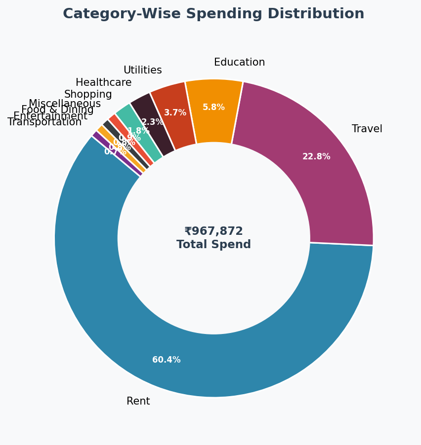
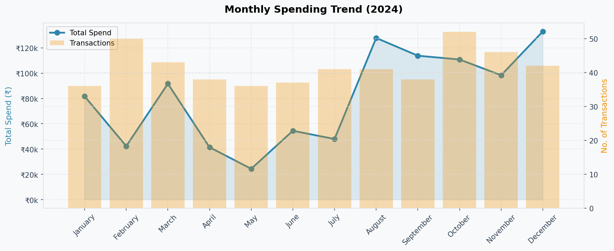
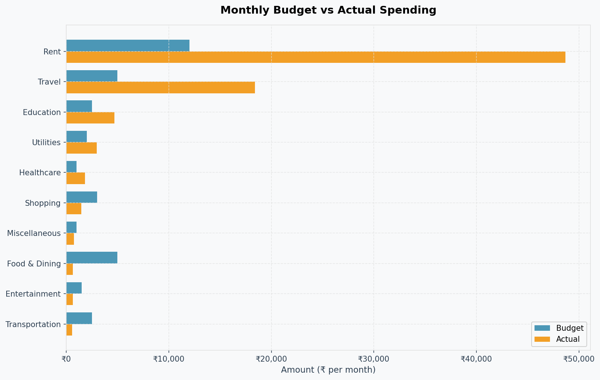
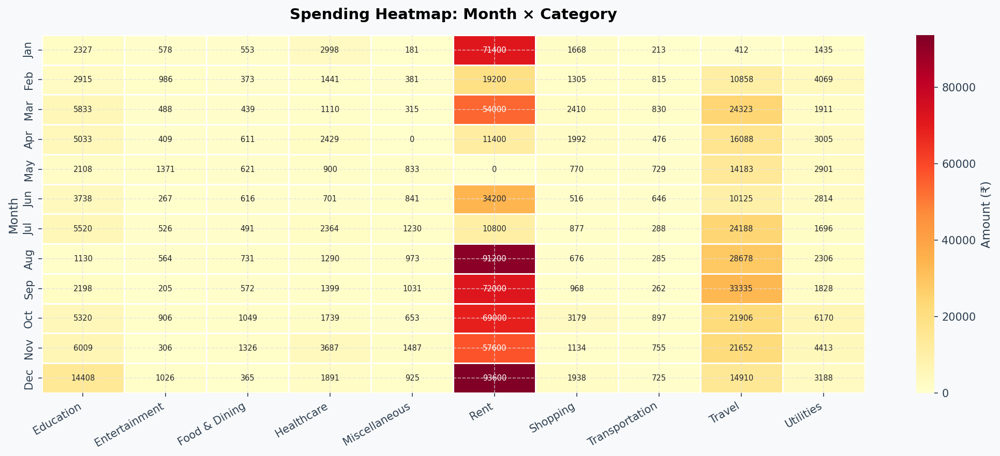
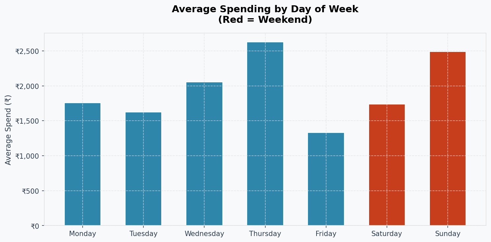
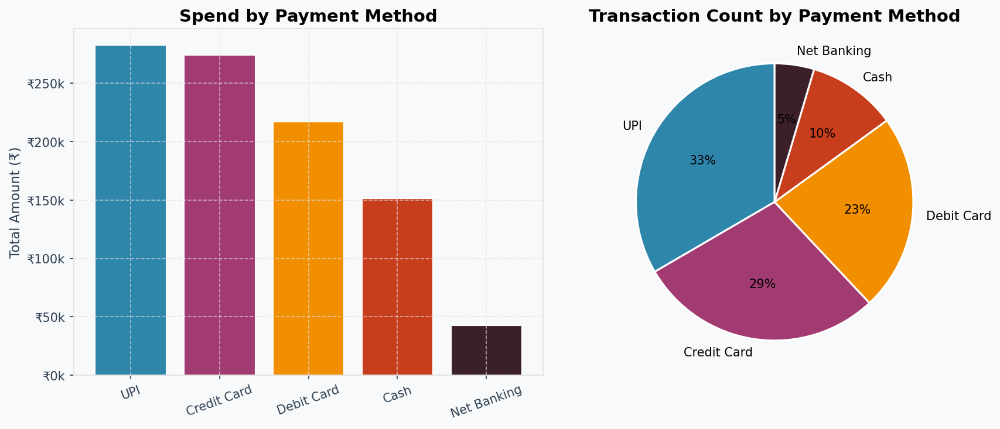
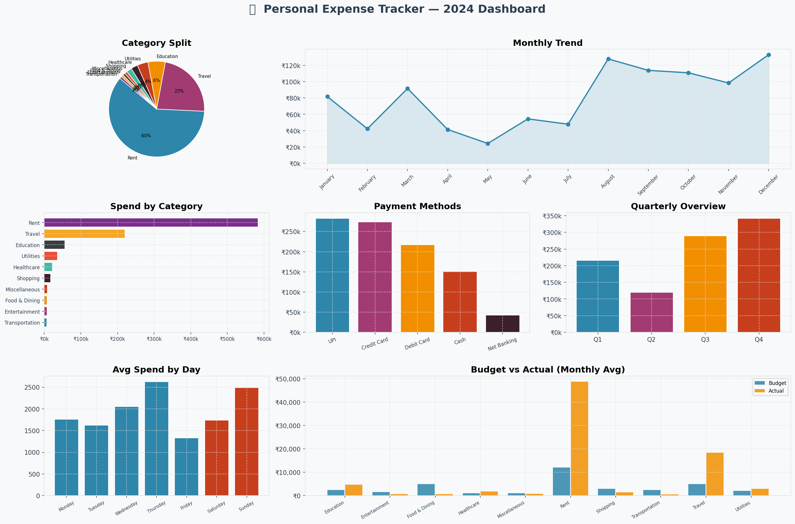

# 💰 Expense Tracker App using Data Science


> **A complete end-to-end Data Science project** that simulates, analyzes, and visualizes personal expense data using Python. Built as a portfolio project for Data Analyst / Business Analyst / Financial Analyst roles.

---

## 📌 Table of Contents

- [Overview](#overview)
- [Problem Statement](#problem-statement)
- [Solution](#solution)
- [Features](#features)
- [Tech Stack](#tech-stack)
- [Project Architecture](#project-architecture)
- [Folder Structure](#folder-structure)
- [Installation](#installation)
- [How to Run](#how-to-run)
- [Results & Outputs](#results--outputs)
- [Key Insights](#key-insights)
- [Streamlit Dashboard](#streamlit-dashboard)
- [Future Improvements](#future-improvements)
- [Interview Questions](#interview-questions)

---

## Overview

The **Expense Tracker App** is a data-science-powered personal finance tool that:
- Generates realistic synthetic expense data (1 year, 500 transactions)
- Cleans and preprocesses the data using Pandas
- Performs comprehensive Exploratory Data Analysis (EDA)
- Produces 10 professional visualizations
- Generates automated insights and budget warnings
- Provides an interactive Streamlit dashboard

This project demonstrates skills directly applicable to **Data Analyst**, **Business Analyst**, and **Financial Analyst** roles.

---

## Problem Statement

Managing personal finances is a critical skill, yet most people have no visibility into:
- Where their money is going
- Which months/categories are over budget
- Spending patterns (weekdays vs weekends, seasonal trends)
- Whether they are on track with financial goals

---

## Solution

A Python-powered expense tracker that:
1. Simulates realistic expense data across 10 categories
2. Cleans and validates the data automatically
3. Analyzes patterns using statistical methods
4. Visualizes insights through professional charts
5. Provides budget alerts and actionable recommendations

---

## Features

| Feature | Description |
|--------|-------------|
| Synthetic Data Generation | 500 realistic transactions across 10 categories |
| Data Cleaning | Null handling, outlier removal, type casting |
| Category Analysis | Spend breakdown with percentages |
| Monthly Trend | Month-over-month change tracking |
| Quarterly Overview | Q1–Q4 aggregation |
| Budget vs Actual | Compare actual spend to defined budgets |
| Heatmap | Month × Category spending matrix |
| Payment Method Analysis | UPI, Credit Card, Cash, etc. |
| Weekday Pattern | Spending differences by day of week |
| Overspend Alerts | Flag transactions above threshold |
| Auto Insights | 7 key insights generated automatically |
| Streamlit Dashboard | Interactive filters and live charts |
| CSV/TXT Reports | Downloadable summary reports |

---

## Tech Stack

| Tool | Purpose |
|------|---------|
| **Python 3.10+** | Core programming language |
| **Pandas** | Data manipulation and analysis |
| **NumPy** | Numerical computations |
| **Matplotlib** | Static chart generation |
| **Seaborn** | Statistical heatmaps and styling |
| **Streamlit** | Interactive web dashboard |
| **Jupyter Notebook** | EDA and exploration |

---

## Project Architecture

```
User Input / Synthetic Data
         ↓
   Data Generation (data_generator.py)
         ↓
   Data Cleaning (data_cleaner.py)
         ↓
   ┌─────────────────────────────────┐
   │        Analysis Layer           │
   │  - Category Analysis            │
   │  - Monthly/Quarterly Trends     │
   │  - Budget vs Actual             │
   │  - Spending Patterns            │
   └─────────────┬───────────────────┘
                 ↓
   ┌─────────────────────────────────┐
   │      Visualization Layer        │
   │  - 10 Charts (PNG)              │
   │  - Streamlit Dashboard          │
   └─────────────┬───────────────────┘
                 ↓
   ┌─────────────────────────────────┐
   │        Output Layer             │
   │  - Text Report                  │
   │  - CSV Summaries                │
   │  - Key Insights                 │
   └─────────────────────────────────┘
```

---

## Folder Structure

```
Expense-Tracker-App/
│
├── data/
│   ├── expenses.csv            ← Raw synthetic dataset
│   └── expenses_clean.csv      ← Cleaned dataset
│
├── notebooks/
│   └── expense_analysis.ipynb  ← Full EDA notebook
│
├── src/
│   ├── __init__.py
│   ├── data_generator.py       ← Synthetic data creation
│   ├── data_cleaner.py         ← Cleaning & preprocessing
│   ├── analysis.py             ← All analytical functions
│   ├── visualizations.py       ← Chart generation
│   └── report_generator.py     ← Reports (txt + csv)
│
├── outputs/
│   ├── 01_category_pie.png
│   ├── 02_category_bar.png
│   ├── 03_monthly_trend.png
│   ├── 04_quarterly.png
│   ├── 05_payment_methods.png
│   ├── 06_weekday_spending.png
│   ├── 07_budget_vs_actual.png
│   ├── 08_heatmap.png
│   ├── 09_top_subcategories.png
│   ├── 10_dashboard.png
│   ├── expense_report.txt
│   ├── category_summary.csv
│   ├── monthly_summary.csv
│   └── budget_analysis.csv
│
├── app.py                      ← Streamlit dashboard
├── main.py                     ← Main pipeline entry point
├── requirements.txt
├── .gitignore
└── README.md
```

---

## Installation

### Prerequisites
- Python 3.10 or higher
- pip

### Step 1: Clone the repository
```bash
git clone https://github.com/YOUR_USERNAME/expense-tracker-app.git
cd expense-tracker-app
```

### Step 2: Create virtual environment (recommended)
```bash
# Windows
python -m venv venv
venv\Scripts\activate

# Mac/Linux
python3 -m venv venv
source venv/bin/activate
```

### Step 3: Install dependencies
```bash
pip install -r requirements.txt
```

---

## How to Run

### Option A: Full Pipeline (Recommended)
```bash
python main.py
```
This runs the complete pipeline: data generation → cleaning → analysis → charts → reports.

### Option B: Streamlit Dashboard (Interactive)
```bash
streamlit run app.py
```
Opens an interactive dashboard at `http://localhost:8501`

### Option C: Jupyter Notebook (EDA)
```bash
jupyter notebook notebooks/expense_analysis.ipynb
```

---

## Results & Outputs

After running `python main.py`, the following are generated:

### Charts (outputs/ folder)

| Chart | Description |
|-------|-------------|
| `01_category_pie.png` | Donut chart of category-wise spend |
| `02_category_bar.png` | Horizontal bar chart by category |
| `03_monthly_trend.png` | Line chart with transaction volume |
| `04_quarterly.png` | Q1–Q4 spending comparison |
| `05_payment_methods.png` | Bar + pie for payment modes |
| `06_weekday_spending.png` | Average spend by day of week |
| `07_budget_vs_actual.png` | Side-by-side budget comparison |
| `08_heatmap.png` | Month × Category heatmap |
| `09_top_subcategories.png` | Top 12 subcategories |
| `10_dashboard.png` | Complete summary dashboard |

### Reports

| File | Description |
|------|-------------|
| `expense_report.txt` | Full text report |
| `category_summary.csv` | Category totals and percentages |
| `monthly_summary.csv` | Month-by-month breakdown |
| `budget_analysis.csv` | Budget vs actual comparison |

---
---
# Expense Analytics Dashboard

This repository contains an automated financial tracking system that generates visual insights from transaction data.

## 📊 Visual Gallery

### Primary Analytics
| Category-wise Spend | Monthly Trends |
|:---:|:---:|
|  |  |
| *01: Donut chart of spend* | *03: Transaction volume* |

### Comparative Analysis
| Budget vs Actual | Spending Heatmap |
|:---:|:---:|
|  |  |
| *07: Budget comparison* | *08: Month × Category density* |

### Temporal & Method Breakdowns
| Weekday Patterns | Payment Methods |
|:---:|:---:|
|  |  |
| *06: Average spend by day* | *05: Bar + pie for modes* |

---

## 🖥️ System Outputs

### Full Dashboard Summary
The image below represents the consolidated `10_dashboard.png` output, providing a high-level view of all metrics.



### Web & Export Formats
| Local Website View | PDF/Image Expense Report |
|:---:|:---:|
|  |  |
| *Live browser interface* | *Final exported report* |

---

## 📂 Other Visuals
* **Category Bars:** `outputs/02_category_bar.png`
* **Quarterly Comparison:** `outputs/04_quarterly.png`
* **Top Subcategories:** `outputs/09_top_subcategories.png`
---

## Key Insights

(Generated from 2024 synthetic data)

- **Total annual spend:** ₹9,67,872 | Monthly average: ₹80,656
- **Highest category:** Rent (60.4% of total spend)
- **Peak spending month:** December (festive season)
- **Most used payment method:** UPI (29.2% of transactions)
- **12 transactions** flagged as potential overspending
- **Weekend spending** is higher than weekdays (₹2,069 vs ₹1,883 avg)
- **Over-budget categories:** Education, Healthcare, Rent, Travel, Utilities

---

## Streamlit Dashboard

The interactive dashboard includes:
- KPI cards (Total Spend, Monthly Avg, Transaction Count)
- Category filters (sidebar)
- Month and Payment Method filters
- Live-updating charts
- Auto-generated insights panel
- Sortable transaction data table

---

## Future Improvements

- [ ] **Mobile App** — Convert to Flutter/React Native
- [ ] **Real-time Tracking** — Connect to bank API or UPI
- [ ] **ML Predictions** — Predict next month's spend using time series (ARIMA/LSTM)
- [ ] **Budget Alerts** — Email/SMS notifications when near limit
- [ ] **Goal Tracking** — Set savings goals and track progress
- [ ] **Multi-user Support** — Family expense tracking with roles
- [ ] **Receipt Scanner** — OCR to extract data from receipts
- [ ] **Currency Support** — Multi-currency for international use

---

## Interview Questions

**Q1: What is synthetic data and why did you use it?**
> Synthetic data is artificially generated data that mimics real-world patterns without containing actual personal information. I used it because real financial data is private and unavailable, but synthetic data still lets us demonstrate all data science techniques authentically.

**Q2: How did you handle outliers?**
> I used the IQR (Interquartile Range) method per category. Transactions above Q3 + 3×IQR were removed to avoid skewing the analysis while retaining genuine high-value transactions.

**Q3: What is the difference between EDA and Data Analysis?**
> EDA (Exploratory Data Analysis) is the process of visually and statistically summarizing a dataset to understand its structure, distributions, and relationships — it's open-ended. Data Analysis is more hypothesis-driven, aimed at answering specific business questions.

**Q4: How does your budget vs actual analysis work?**
> I defined monthly budget targets per category, then calculated the actual average monthly spend (total ÷ 12). The variance shows over/under-budget status, helping identify problem areas.

**Q5: What business decisions can be made from this project?**
> A business can identify cost overruns by department, reduce unnecessary spending, plan quarterly budgets, analyze vendor payment preferences, and detect anomalous transactions for fraud detection.

---

## License

This project is licensed under the MIT License.

---

## Author

**Your Name**  
Data Science | Data Analytics | Business Intelligence  
[LinkedIn](https://linkedin.com/in/yourprofile) | [GitHub](https://github.com/yourusername)

---

> ⭐ If you found this project useful, please give it a star on GitHub!
